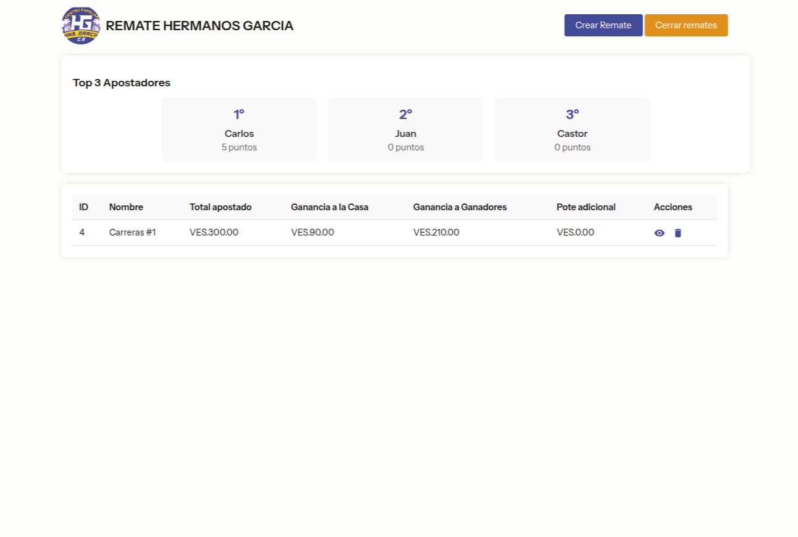
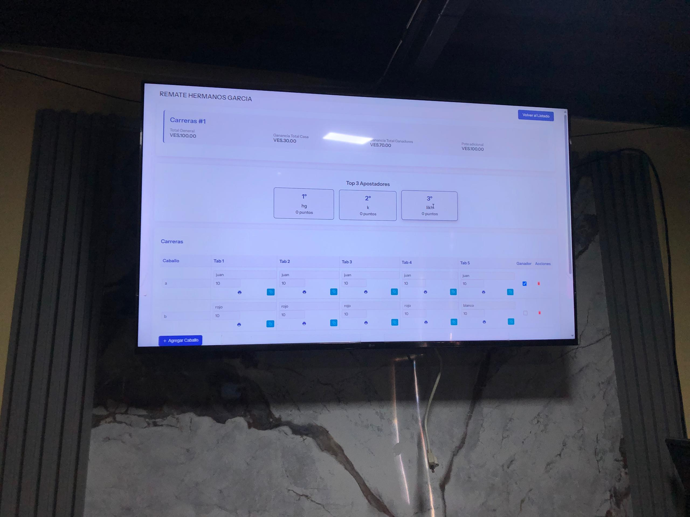

# Remate

Larave application for Auction bets

## Installation

Use the dependency manager [Composer](https://getcomposer.org/) to install Laravel and Native PHP.

```bash
git clone https://github.com/JDonquis/remate.git
```

```bash
composer install
npm install
```

```bash
cp .env.example .env
```

Set values of MySQL database and then:

```bash
php artisan migrate --seed
```

```bash
php artisan native:serve
```

## **Tools**

-   Laravel 12
-   Custom CSS




## **Get in touch**

[juandonquis07@gmail.com](mailto:juandonquis07@email.com)
